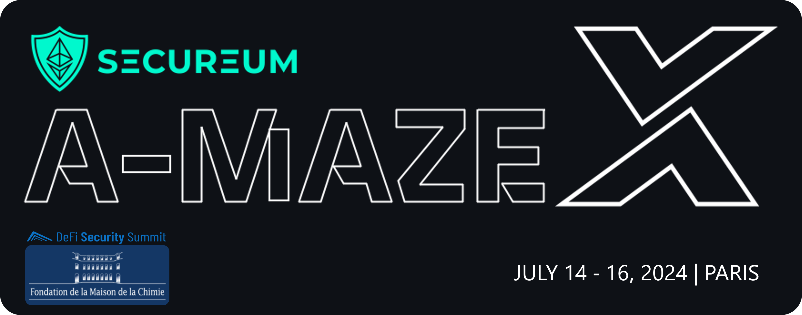

# **Secureum A-MAZE-X Maison de la Chimie, DeFi Security Summit**

## **A Smart Contract Security _Capture the Flag_ Workshop**


\*Hosted by [Defi Security Summit](https://defisecuritysummit.org) as part of **[Defi Security 101](https://defisecuritysummit.org/defi-101-2023/)\***\
_Built with love by [eugenioclrc](https://github.com/eugenioclrc), [luksgrin](https://github.com/luksgrin), [PeterisPrieditis](https://github.com/PeterisPrieditis), [RomiRand](https://github.com/RomiRand) and [misirov](https://twitter.com/p_misirov)_\
_Special thanks to [patrickd](https://github.com/patrickd-), [StErMi](https://github.com/StErMi), [tinchoabbate](https://github.com/tinchoabbate) and [Rajeev](https://twitter.com/0xrajeev) for reviewing, commenting and helping during the elaboration and design of this CTF Workshop_

---

<br>

- ✅ 1. Operation magic redemption 🪄🔮
- ❌ 2. Mission Modern WETH: Rescue the Ether 🧗🧭
- ❌ 3. LendEx pool hack 🤺🃏
- ❌ 4. Operation Rescue `POSI` Token 💼🔓
- ❌ 5. Balloon Vault 🎈🎈
- ❌ 6. Safe Yield? 🏦📈
- ❌ 7. Crystal DAO 💎💎
- ❌ 8. Liquidatoooor 🔱🔱

```bash
forge test --match-path test/ChallengeX.t.sol
```

Alternatively, to check if all challenges have been solved, execute the following command:

```bash
bash isSolved.sh
```

which will return the test results for all challenges in order.

If one wishes to have a more detailed prompt (i.e. to see the logged messages), it is necessary to increase the verbosity with `-vvvv`, for example:

```bash
forge test --match-path test/ChallengeX.t.sol -vvvv
```
